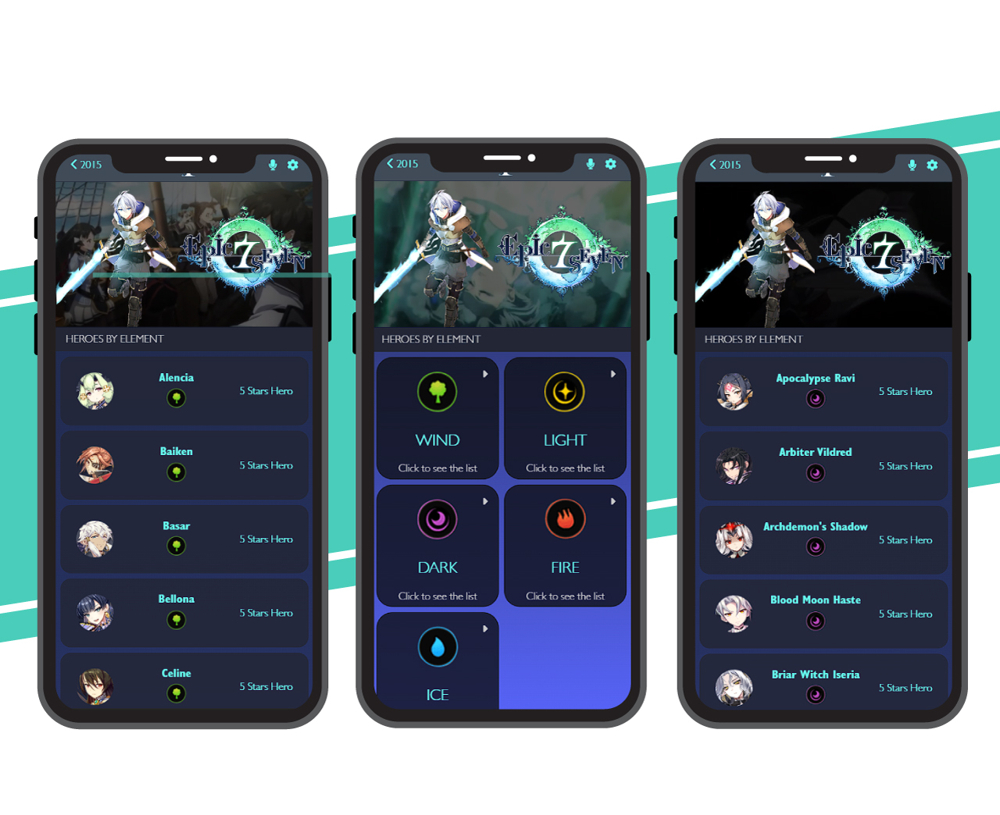

# Project Name

- Epic Seven Hero List

## Project Website (Netlify)

[Web Deployment Netlify](https://zeraltz-epic7-metrics.netlify.app/)
Disclaimer: Please use the mobile emulation to have a better experience using the app, desktop breakpoints are being developed.

## Clone the Project

- `git clone - https://github.com/Zeraltz/metrics-webapp.git`

## Screenshots

## Built With

[Loom Video](https://www.loom.com/share/8613229ec9b245e9bd28d17301d0c8e5)

## Built With

- HTML
- SCSS
- JavaScript
- React.JS
- Redux
- VSCode

## Getting Started

**This app allows Epic Seven players to filter all heroes by their dedicated element, such element could be either Ice, Fire, Wind, Dark or Light. This allows the player to know what hero he wants before rerolling or summoning heroes in the game. The app is going to be improved with time to also show the description, stats and recomended gear for every hero in the game**

## Authors

👤 **Author**

- GitHub: [@Zeraltz](https://github.com/Zeraltz)
- Twitter: [@MauroCantillo\_](https://twitter.com/MauroCantillo_)
- LinkedIn: [Mauricio Cantillo](https://www.linkedin.com/in/mauricio-cantillo-moreno)

## 🤝 Contributing

Contributions, issues, and feature requests are welcome!

Feel free to comment your opinion

## Show your support

Give a ⭐️ if you like this project!

## Acknowledgments

- E7 DataBase API: [Raphael Oliveira](https://www.linkedin.com/in/raphaelddl/?locale=en_US)
- Design Idea: [Nelson Sakwa](https://www.behance.net/sakwadesignstudio).
- Microverse

## 📝 License

This project is [MIT](/LICENSE) licensed.
